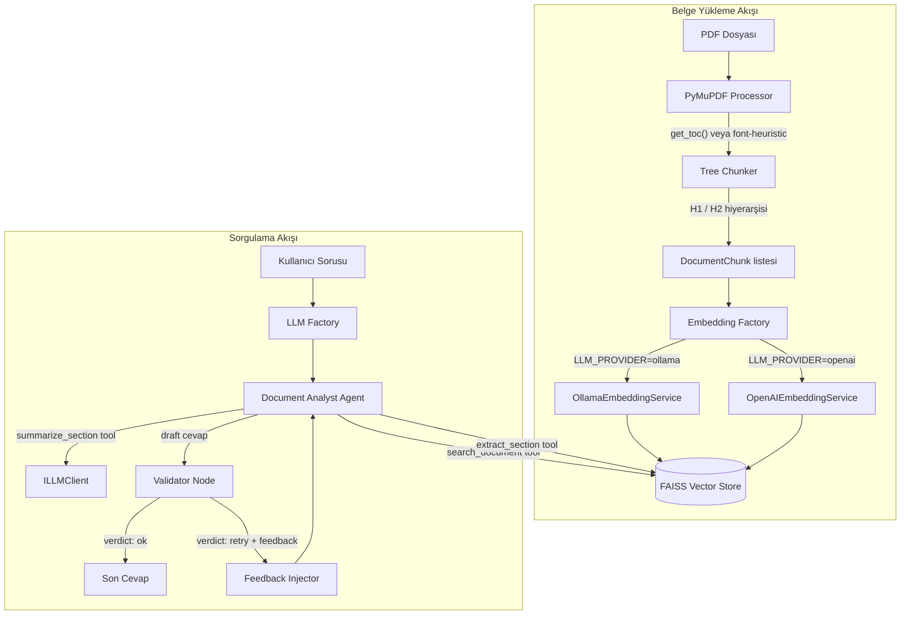

# Banking Agentic Platform - Mimari Tasarım ve Dokümantasyon

Bu döküman, projenin mevcut (MVP) mimari akışını ve "Enterprise" (günde 1 milyon+ işlem hacmi) seviyesine geçiş vizyonunu açıklar.

## 1. MVP Sistem Akışı

Sistem, Clean Architecture kurallarına sadık kalarak Belge Yükleme (Ingestion) ve Sorgulama (Query) olarak iki ana koldan çalışmaktadır.

## 2. Teknik Gereksinimlerin Kod Düzeyinde Açıklaması

**1. Belge Ön İşleme (Document Pre-processing):**
- `src/infrastructure/document_processing/pymupdf_processor.py` içerisinde `process_pdf()` ile PDF açılır. `doc.get_toc()` çağrısı yapılarak içindekiler tablosu (ToC) aranır.
- Eğer ToC varsa `_build_from_toc()`, yoksa font büyüklüğüne dayalı `_build_from_font_heuristic()` metodu devreye girer.
- Her düğüm, ilgili sayfalara ait ham metni (`raw_text`) taşıyarak `TreeChunker`'a aktarılır.

**2. Yapısal Navigasyon (Structural Navigation):**
- `src/infrastructure/document_processing/tree_chunker.py` dosyasındaki `chunk()` metodu, stack tabanlı bir parent-child algoritması uygular. H2 düğümleri otomatik olarak bir üst H1 düğümünün `children` listesine yerleşir.
- Üretilen her `DocumentChunk`, kendi `parent_id`'sini ve `metadata["section_title"]` etiketini taşır.
- `max_chunk_chars=1500` sınırı ile aşırı uzun bölümler, ebeveyn bağı kopmadan güvenli parçalara ayrılır.

**3. Retrieval Stratejisi:**
- `EmbeddingFactory` üzerinden dinamik seçilen sağlayıcı (örn. `OllamaEmbeddingService`) ile `embed_query()` çalıştırılarak sorgu vektörü elde edilir.
- `src/infrastructure/vector_stores/faiss_store.py` içerisindeki `search()` metodu, `IndexFlatL2` ile L2 mesafe bazlı en yakın komşu (k-NN) araması yapar. Dimension (boyut) uyumsuzluğu koruması lazy-initialization ile çözülmüştür.
- Dönen `RetrievedContext` nesneleri `section_title`, `page` ve `score` verilerini içerir ve kullanıcıya şeffaf bir şekilde yansıtılır.

**4. Ajan Mimarisi:**
- `src/application/agents/document_analyst_agent.py` LangGraph `StateGraph` kullanılarak tasarlanmıştır. Akış: `agent → tools → agent` şeklindedir.
- Ajan 3 yeteneğe sahiptir: `search_document` (genel vektör araması), `extract_section` (başlık spesifik arama) ve `summarize_section` (ILLMClient delegasyonu ile özet çıkarma).
- Ajan sınıfı LLM sağlayıcısından bihaberdir; kendisine `LLMFactory` tarafından üretilen `ChatOllama` veya `ChatOpenAI` nesnesi dependency injection ile aktarılır.

**5. Doğrulama ve Güvenilirlik (Validation Layer):**
- Ajan bir taslak cevap ürettiğinde akış hemen bitirilmez, LangGraph üzerindeki `validator` düğümüne yönlendirilir.
- `VALIDATOR_PROMPT`, cevabın soruyu yanıtlayıp yanıtlamadığını, kaynak gösterip göstermediğini ve uydurma veri içerip içermediğini sorgular.
- Eğer JSON sonucu `{"verdict": "retry"}` ise, süreç `feedback_injector` düğümüne düşer ve ajan eksikleri gidermesi için tekrar tetiklenir. `validation_attempts >= 2` kısıtıyla sonsuz döngü engellenir.

**6. Bellek Yönetimi (Memory):**
- **Mevcut MVP:** `AgentState` içerisinde `messages` alanı, LangGraph'ın `add_messages` reducer'ı ile tanımlanmıştır. Bu, sistemin temel bir "konuşma günlüğü" tutmasını sağlar.
- **Geliştirme Durumu:** Şu anki mimari, her adımda mesajları state içinde tutmaktadır; ancak bu geçmişin LLM'e "bağlam" olarak aktarılması (context window injection) süreci, `HistoryAwareRetriever` entegrasyonu aşamasındadır. MVP kapsamında öncelik, yanıtların doğrulanabilirliğine (Validator Node) verildiği için, çok turlu konuşmalarda geçmişi hatırlama mekanizması ilerleyen süreçlerdeki geliştirme fazına bırakılmıştır. Uzun vadeli (cross-session) bellek, Enterprise geçişte Milvus/PostgreSQL tabanlı kalıcı memory ile yönetilecektir.

---

## 3. Enterprise Vizyon

MVP kodunda temelleri atılan Clean Architecture prensipleri sayesinde aşağıdaki enterprise yeteneklere geçiş sıfır "business logic" (domain) değişikliği ile mümkündür:

### 3.1. API Gateway & Asenkron İşlemler
- **Java/Spring Boot API Gateway:** İstemcilerden gelen tüm istekleri (REST/gRPC) karşılayan, Auth (OAuth2/OIDC), Rate Limiting ve Load Balancing yapan katman.
- **Kafka Kuyrukları:**
  - `document-ingestion-events`: Sisteme yüklenen PDF'lerin asenkron ve dağıtık worker'lar tarafından işlenmesi için.
  - `query-events`: Karmaşık ve çoklu-belge analiz sorguları için event-driven altyapı.

### 3.2. Vektör Veritabanı Kümesi
- MVP'deki yerel **FAISS-CPU**, yatayda ölçeklenebilen, yüksek erişilebilir **Milvus** veya **Qdrant** kümesine geçirilecektir. `IVectorStore` interface'i bu geçişi pürüzsüz kılar.

### 3.3. Çoklu Ajan (Multi-Agent) Yapısı
Şu anki tek ajanlı yapı, 3 uzmanlaşmış ajana bölünecektir:
1. **Navigator Agent:** İsteği anlar, hedef belgeleri/araçları belirler.
2. **Retrieval Agent:** Veriyi çeker, özetler ve işler.
3. **Validator Agent:** Kurum regülasyonlarına göre PII veya risk kontrolü yapar.

Ajanlar arası iletişim, LangGraph'ın StateGraph nesnesindeki paylaşımlı messages (State) yapısı üzerinden gerçekleşir. Her ajan kendi uzmanlık alanına göre state'i günceller ve graph.send_message() ile bir sonraki ajana bağlamı (context) devreder.

### 3.4. Güvenlik ve PII Maskeleme
- `IPIIMasker` portu (örn. Microsoft Presidio implementasyonu) devreye alınarak, LLM'e giden ve dönen verilerdeki kişisel veriler maskelenecektir.
