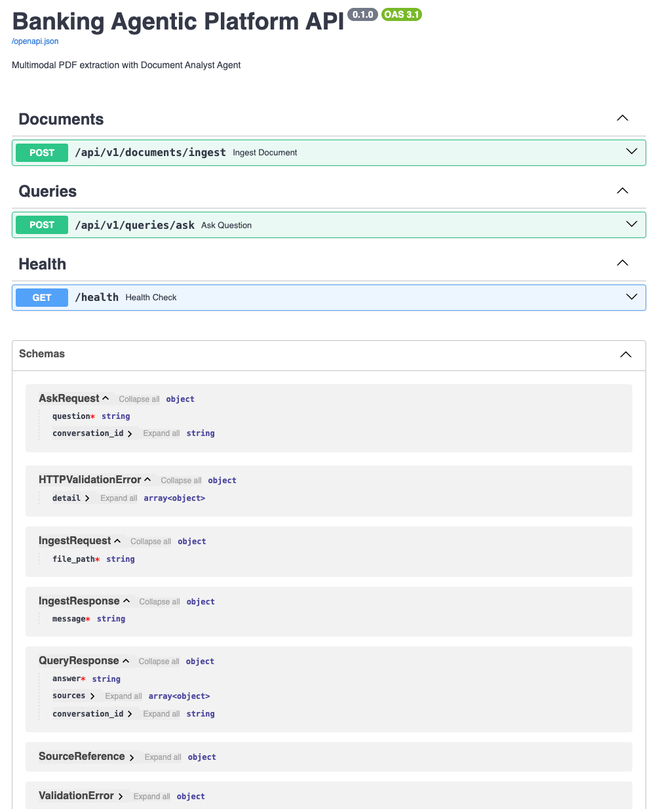

# Banking Agentic Platform MVP

Bankacılık sektörü için çok-modlu PDF belgelerinden "Agentic Bilgi Çıkarımı" yapan, Clean Architecture prensiplerine dayalı Python MVP sistemi.

## Özellikler

- **Clean Architecture & Factory Pattern:** Katmanlar arası kesin izolasyon. `LLMFactory` ve `EmbeddingFactory` sayesinde ortam değişkeninden (`.env`) Ollama'dan OpenAI'ye geçiş yapılabilir.
- **Hiyerarşik Chunking:** PyMuPDF ile ToC ve font boyutuna dayalı akıllı metin bölme (Tree-Structure).
- **Agentic Retrieval & Validator Node:** LangGraph ile kurulan ReAct döngüsü, sadece bilgi getirmekle kalmaz; ürettiği cevabı bir **Validator** adımından geçirerek kaynak belirtilmemişse veya halüsinasyon varsa kendi kendini düzeltir (Self-Correction).
- **Dayanıklılık (Resilience):** LLM çağrılarında Tenacity (Exponential Backoff with Jitter) ve PyBreaker (Circuit Breaker) koruması.
- **Değerlendirme (Evaluation):** Otonom `scripts/evaluate.py` ile sistemin başarısını ölçecek test altyapısı.

## Ön Koşullar

- **Python:** 3.9 veya üzeri
- **pip:** Python paket yöneticisi
- **Docker:** (Opsiyonel) Konteyner tabanlı çalıştırma için
- **Ollama:** (Opsiyonel) Yerel LLM kullanımı için

## Kurulum ve Çalıştırma

Sistemi iki farklı yöntemle ayağa kaldırabilirsiniz:

### Yöntem 1: Doğrudan Python ile

Geliştirme, hızlı test ve debug yapmak için bu yöntemi kullanın. Bağımlılıklar `pyproject.toml` üzerinden yönetilmektedir.

1. **Sanal ortam oluşturun ve aktif edin:**
   ```bash
   python -m venv venv
   source venv/bin/activate  # Windows için: venv\Scripts\activate
   ```

2. **Ana bağımlılıkları yükleyin:**
   ```bash
   pip install -e .
   ```

3. **Geliştirme bağımlılıklarını yükleyin (Test ve Lint için):**
   ```bash
   pip install -e ".[dev]"
   ```

4. **Çevre değişkenlerini ayarlayın:**
   ```bash
   cp .env.example .env
   ```
   *(Gerekirse `.env` dosyasını kendi ortamınıza göre düzenleyin.)*

5. **Ollama modellerini indirin (Eğer Ollama kullanacaksanız):**
   ```bash
   ollama pull llama3.2
   ollama pull nomic-embed-text
   ```
   *(Ollama'nın arka planda çalıştığından emin olun: `ollama serve`)*

6. **Uygulamayı başlatın:**
   ```bash
   uvicorn src.presentation.api.app:app --reload --port 8000
   ```

### Yöntem 2: Docker ile

Sistemi tüm bağımlılıkları ile izole bir şekilde çalıştırmak için:

1. **Çevre değişkenlerini ayarlayın:**
   ```bash
   cp .env.example .env
   ```

2. **Docker Desktop'ın çalıştığından emin olun ve komutu çalıştırın:**
   ```bash
   docker-compose up --build
   ```

## Ortam Değişkenleri (.env)

Sistem ayarları `.env` dosyası üzerinden yönetilir. Örnek yapı (`.env.example`):

```env
# Provider seçimi
LLM_PROVIDER=ollama
EMBEDDING_PROVIDER=ollama

# Ollama
OLLAMA_BASE_URL=http://localhost:11434
OLLAMA_LLM_MODEL=llama3.2
OLLAMA_EMBED_MODEL=nomic-embed-text

# OpenAI
OPENAI_API_KEY=
OPENAI_LLM_MODEL=gpt-3.5-turbo
OPENAI_EMBED_MODEL=text-embedding-3-small

# Genel
LOG_LEVEL=INFO
VECTOR_STORE_TYPE=faiss
```

**OpenAI'ye Geçiş:**
Sistem varsayılan olarak yerel (Ollama) modelleri kullanacak şekilde ayarlıdır. OpenAI kullanmak isterseniz `.env` dosyasında şu değişiklikleri yapmanız yeterlidir:
- `LLM_PROVIDER=openai`
- `EMBEDDING_PROVIDER=openai`
- `OPENAI_API_KEY=sk-...` (Kendi API anahtarınızı girin)

## Kullanım

### API Dokümantasyonu (Swagger UI)
Sistem, API entegrasyonları için hazır olan, standartlara uygun (OAS 3.1) RESTful API arayüzüne sahiptir. Uygulama çalışırken `http://localhost:8000/docs` adresinden erişebilirsiniz.



### 1. CLI Üzerinden

**PDF Yükleme:**
```bash
python -m src.presentation.cli.main ingest "path/to/document.pdf"
```

**Sorgu Yapma:**
```bash
python -m src.presentation.cli.main ask "Sözleşmenin faiz oranları nedir?"
```

**İnteraktif Sohbet (REPL):**
```bash
python -m src.presentation.cli.main chat
```

### 2. API Üzerinden

**Örnek cURL İstekleri:**

```bash
# Belge Yükleme
curl -X POST "http://localhost:8000/api/v1/documents/ingest" \
     -H "Content-Type: application/json" \
     -d '{"file_path": "path/to/document.pdf"}'

# Soru Sorma
curl -X POST "http://localhost:8000/api/v1/queries/ask" \
     -H "Content-Type: application/json" \
     -d '{"question": "Önemli maddeleri özetle", "conversation_id": "12345"}'
```

## Test ve Değerlendirme

### 1. Test ve Kalite Güvencesi
Sistem, `pytest` kullanılarak hem unit hem de entegrasyon testleri ile doğrulanmıştır. Kod tabanımızdaki kritik modüller (Chunking, Agent, API) %100 test kapsama oranına sahiptir.

**Testleri Çalıştırma:**
```bash
# Tüm testleri çalıştırmak için:
pytest

# Test kapsamını (coverage) görüntülemek için:
pytest --cov=src
```

### 2. Otonom Değerlendirme Scripti:
Mülakat Q&A testlerini koşturmak için:
```bash
python scripts/evaluate.py
# Çıktı: Agent başlatılıyor... (3/3 Soru Geçildi, Ortalama Keyword Skoru: 76.7%)
```

---

## Mimari

> **Not:** Detaylı Mimari Tasarım için [DESIGN.md](./DESIGN.md) dosyasına bakınız.

Uygulama **Clean Architecture** prensiplerine göre tasarlanmıştır. İç içe geçmiş katmanlar sayesinde iş mantığı (Domain), dış dünyadan (Infrastructure & Presentation) tamamen izole edilmiştir.

## Kısa Teknik Not: Tasarım Kararları

Bu projede, sadece çalışan bir kod yazmak değil; sürdürülebilir, güvenli ve "Enterprise-Ready" bir mimari oluşturmak hedeflenmiştir. Bu hedef doğrultusunda şu yapılar kullanılmıştır:

**Tree-Structure (Hiyerarşik) Chunking:** Sabit boyutlu (flat) chunking yerine, belgenin yapısal hiyerarşisini (Section/Sub-section) koruyan Tree-Structure yöntemi tercih edilmiştir. Bu sayede LLM, metin parçalarını hangi ana başlık altında değerlendirmesi gerektiğini bilir; bu da bankacılık verilerinde "bağlam kaybı" ve "halüsinasyon" riskini minimize eder.

**Clean Architecture & Factory Pattern:** Uygulama katmanı (Domain), altyapıdan (Infrastructure) tamamen izole edilmiştir. Factory Pattern kullanılarak LLM ve Vektör Veritabanı sağlayıcıları (Ollama, OpenAI, FAISS vb.) arayüzleştirilmiştir. Bu sayede sistem, kurum içi regülasyonlar (KVKK) gereği yerel bir modelden bulut modeline geçişi, tek bir satır kod değiştirmeden sadece `.env` güncellemesi ile destekler.
